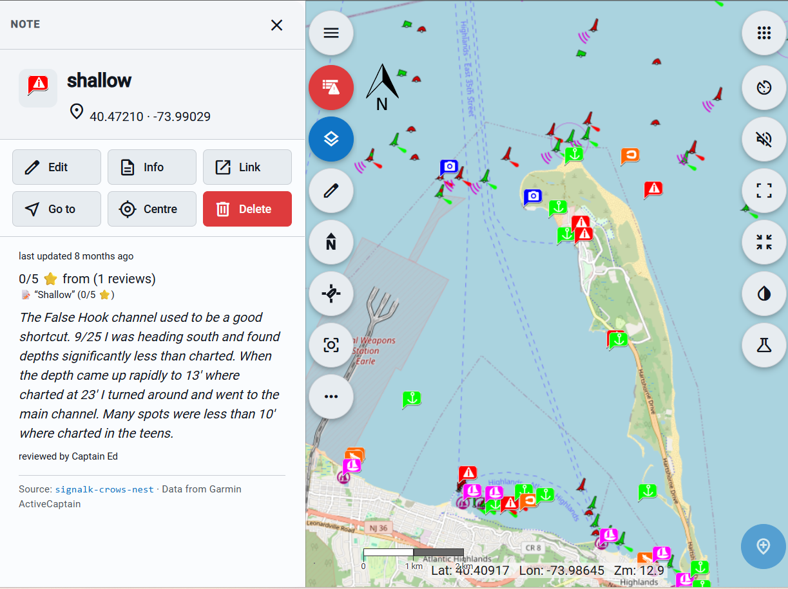
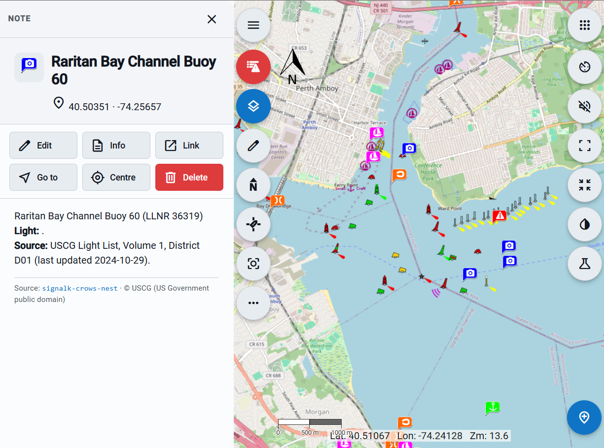
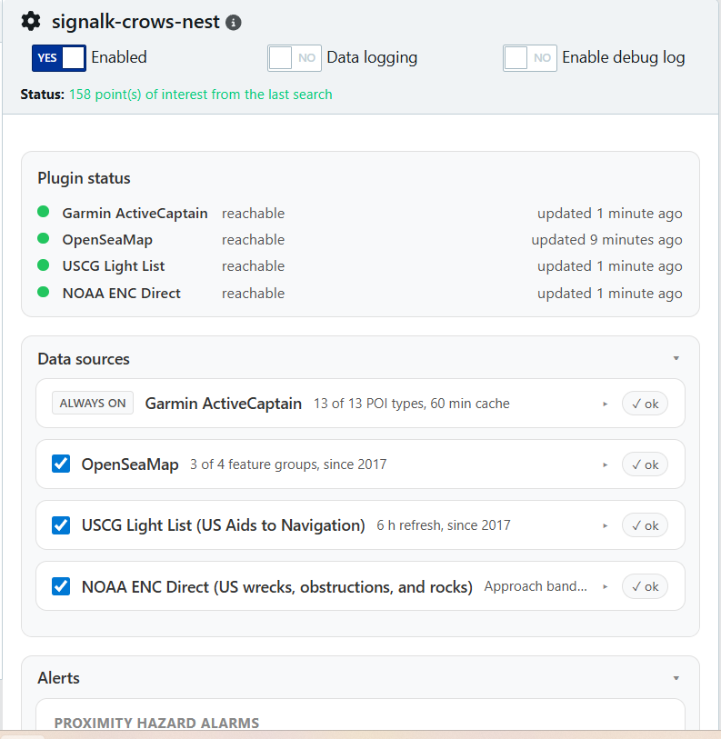

# Crow's Nest

[](https://www.npmjs.com/package/signalk-crows-nest)
[](https://www.npmjs.com/package/signalk-crows-nest)
[](https://github.com/NearlCrews/signalk-crows-nest/actions/workflows/ci.yml)
[](https://github.com/NearlCrews/signalk-crows-nest/actions/workflows/eslint.yml)
[](https://github.com/NearlCrews/signalk-crows-nest/actions/workflows/plugin-ci.yml)
[](https://github.com/NearlCrews/signalk-crows-nest/blob/main/LICENSE)
[](https://nodejs.org)
[](https://www.buymeacoffee.com/nearlcrews)

A points-of-interest importer for [Signal K](https://signalk.org): it pulls
marinas, anchorages, hazards, aids to navigation, and chart hazards from four
marine data sources and publishes them as Signal K `notes` resources, with
proximity, route-corridor, and bridge air-draft alarms.

> Built on the foundation of [`signalk-activecaptain-resources`](https://github.com/KvotheBloodless/signalk-activecaptain-resources)
> by Paul Willems and the Signal K community.

> The alarms and the imported data are advisory. They are not certified for
> safety-of-life navigation: always cross-check against official charts and
> your primary instruments.

## What's new in 0.11.0

Route drafting can now offload its on-water routing to the Binnacle Companion
container when it is installed, which keeps the heavy geometry off the Signal K
server. The built-in router stays as an automatic fallback, so a standalone
install is unchanged. This builds on **AI route drafting** (beta), introduced in
the 0.10 line (see the [changelog](CHANGELOG.md#v0110)).

> **AI route drafting is in beta.** It cannot guarantee accuracy. The model can
> place a waypoint in error and the safety check runs on generalized and modeled
> data, not on certified charts. Treat every drafted route as a suggestion only,
> and verify it against the official charts and your primary instruments before
> you navigate it. Never follow a drafted route on the AI's word alone.

- **Route through the Binnacle Companion router when available.** When the
  Binnacle Companion plugin is installed and its container is running, route
  drafting sends the on-water routing to the container and uses the result, with
  the built-in router as an automatic fallback when the companion is absent, not
  ready, or unreachable. A new "Use Binnacle Companion router when available"
  setting, on by default, controls it, and turning it off forces the built-in
  router. Border-aware routing through the companion uses the maritime boundary
  source, which covers the open-sea borders the built-in admin-0 source did not,
  and does not cover the inland and river boundaries it did. Every drafted route
  remains a draft you verify on the chart.

See the [changelog](CHANGELOG.md#v0110) for the full list.

## What it does

Signal K is an open marine data standard that streams a boat's navigation,
environment, and AIS data over a single API. Crow's Nest is a Signal K
server plugin that fills the chart around that data: it imports points of
interest from four sources, merges duplicates into one corroborated marker,
and serves them as standard `notes` resources that chartplotters such as
[Freeboard-SK](https://github.com/SignalK/freeboard-sk) display natively.

It is built for life on a boat: details are cached on disk so the chart
keeps working offline, refresh traffic is debounced and sized to each
upstream's real update rate, and the same POI data drives three safety
alarms (hazard proximity, hazards on the route ahead, and a bridge
air-draft check).

## Features

- **Four data sources, merged into one chart layer.** Garmin ActiveCaptain
  is the base; OpenSeaMap (OpenStreetMap marine data via the Overpass API),
  the USCG Light List of US Aids to Navigation (US-only), and NOAA ENC
  Direct (US authoritative wrecks, obstructions, and underwater rocks,
  US-only) are opt-in. Cross-source duplicates merge into the ActiveCaptain
  base, and the surviving note records every contributing source as a
  corroboration signal.
- **A broad point-of-interest overlay** as Signal K `notes` resources:
  marinas, anchorages, hazards, businesses, boat ramps, bridges, dams,
  ferries, inlets, locks, local knowledge, navigational aids, airports,
  lighted and unlighted aids, daymarks, racons, wrecks, obstructions, and
  underwater rocks.
- **Proximity hazard alarms** with hysteresis: a Signal K notification
  fires when a Hazard point comes within a configurable radius and clears
  once the vessel moves beyond it.
- **Route-corridor hazard scan**: warns about hazards, bridges, and locks
  on the active Course API route ahead, with along-track distance and ETA.
- **Bridge air-draft check**: warns when a bridge's vertical clearance is
  at or below the vessel air draft (`design.airHeight` or a configured
  fallback) plus a safety margin, both as a proximity alarm as the vessel
  nears a too-low bridge and as a clearance-specific route warning ahead.
- **AI route drafting (beta, optional, admin only, off until you set a key)**:
  turn a plain-language passage request into a drafted route. This feature is
  in beta: it cannot guarantee accuracy, so every drafted route is a draft you
  must verify against the official charts before you navigate it. With an
  OpenRouter key configured, the plugin asks the model for the turning
  waypoints, then checks every leg in owned code and adds a deterministic
  fuel estimate. Where charted depth (US ENC) or mapped water covers the
  passage, a deterministic channel router replaces the model's straight legs
  with a water-following route over a depth-aware navigable grid plus A*, so
  the waypoints follow the channel rather than cutting across land. The
  endpoint also optimizes a drawn route: pass a `route` and it refines that
  polyline instead of drafting from words, anchors the drawn endpoints, and
  returns an `optimized` marker. The safety check covers routes worldwide,
  resolving data providers per leg: NOAA ENC charted depth, land, and point
  hazards in US waters, OpenSeaMap point hazards and an OpenStreetMap coastline
  land check worldwide, and EMODnet modeled depth (awareness-grade, referenced
  to Lowest Astronomical Tide) in European seas. Every dimension is either
  checked with its value and datum stated or flagged explicitly as not checked,
  never silently passed. The route is always a draft you verify on the chart
  before saving, the depth check reads the charted depth-area contour rather
  than the depth at every point, and a daily call cap bounds the OpenRouter
  spend.
- **Rich point detail** rendered as plain-English HTML, with the
  source-specific attribution credit (ODbL for OSM, CC0 for NOAA, US
  Government public domain for USCG, Garmin ActiveCaptain for the base)
  published as a structured `properties.attribution` field on every note,
  so a client UI can render it in chrome rather than next to the POI text.
- **A normalized detail schema for structured clients**: every note also
  carries a presentation-neutral `properties.crowsNest` view of the same
  detail alongside the HTML, documented in the
  [notes-resource integration guide](docs/notes-resource-format.md), so a
  richer chartplotter can render the sections natively and skip the HTML.
- **Persistent, offline caching.** ActiveCaptain details live in a 30-day
  on-disk store with stale-on-error fallback; the USCG Light List index is
  sharded on disk and queried through an in-memory spatial tile index for
  sub-millisecond bbox lookups.
- **Refresh debounce per source**: each at-runtime source snaps the
  viewport to a coarse tile and serves stale while revalidating, so a
  Freeboard refresh burst on a stationary viewport reuses the cached
  result rather than flooding the upstream.
- **Filters to cut clutter**: a minimum-rating filter on ActiveCaptain, a
  per-source earliest-year filter (`SORDAT` survey vintage on NOAA ENC,
  `MODIFIED_DATE` on USCG, OSM element timestamp on OpenSeaMap), and a
  freshness warning in the popup for an ActiveCaptain Hazard whose report
  has not been confirmed in over two years.
- **A React configuration panel** with a per-source status bar, an
  accordion of cards each with a live-status pill, an Alerts section, and
  a theme toggle with light, dark, and a red-preserving night mode.

## Screenshots

Points of interest from every source land on the chart as Signal K notes,
each with a plain-English popup, and the whole plugin is configured from
one panel.

| ActiveCaptain hazard | USCG Light List aid | Configuration panel |
| --- | --- | --- |
| [](assets/screenshots/freeboard-activecaptain-hazard.png) | [](assets/screenshots/freeboard-uscg-light-list.png) | [](assets/screenshots/admin-panel.png) |

## Architecture

Crow's Nest is one plugin built from focused modules:

- **TypeScript 6 under strict flags.** The Node plugin compiles with `tsc`;
  the React configuration panel bundles with webpack 5 as a Module
  Federation remote that the Signal K admin UI loads.
- **Inputs and outputs.** Every POI source is a self-contained input module
  (ActiveCaptain, OpenSeaMap, USCG Light List, NOAA ENC Direct) and every
  consumer is an output module (the `notes` provider, the proximity alarm,
  the route-corridor scan, and the bridge air-draft check), each registered
  on one line in the plugin entrypoint.
- **One aggregate source.** A registry fans each chart request out to every
  enabled input, namespaces the ids, unions the results, records per-source
  health, and runs the dedupe pass that merges duplicates within a
  configurable radius (default 150 feet).
- **Polite HTTP.** Queued, throttled clients with retry and `Retry-After`
  handling for the high-volume sources; conditional GET for the USCG feed;
  Overpass fallback mirrors so a single instance outage does not take the
  source offline; and a US-waters gate that skips outbound HTTP on the
  US-only feeds when the vessel is elsewhere.
- **Tested on `node:test`** via `tsx`, with ESLint 9 and neostandard.

See the [architecture notes](CLAUDE.md) for the full module map.

## Signal K paths

Crow's Nest is a well-behaved Signal K citizen: it reads a few `vessels.self`
paths and the Course API, and it writes only `notes` resources and
notifications under its own branch. All values are SI units (position in
decimal degrees, distances and heights in meters).

**Reads (from `vessels.self`):**

- `navigation.position` — the viewport centre for POI fetches, the US-waters
  gate on the US-only feeds, and the proximity and route scans.
- `navigation.speedOverGround` — ETA math in the route-corridor scan.
- `design.airHeight` — the vessel air draft for the bridge-clearance check
  (a configured fallback is used only when this path is absent).
- `design.draft` (`value.maximum`) — the vessel draft for the AI route-draft
  depth check, when the panel's draft field is left at 0.
- The **Course API** active route — the route-corridor hazard scan reads the
  active route to look ahead along the planned track.

**Writes:**

- `resources/notes` — every imported POI is published as a Signal K `note`
  resource (with the source-agnostic structured detail on
  `properties.crowsNest` alongside the HTML description) so chartplotters such
  as Freeboard-SK can display it.
- `notifications.navigation.crowsNest.hazard.<id>` — proximity hazard alarms.
- `notifications.navigation.crowsNest.route.<id>` — route-corridor hazard
  alarms (including the too-low-bridge verdict).
- `notifications.navigation.crowsNest.bridgeClearance.<id>` — bridge
  air-draft alarms.

The plugin also serves an admin-gated `GET` status endpoint and the optional,
admin-gated `POST /api/route-draft` endpoint (off until an OpenRouter key is
set); see [the route-draft API notes](docs/route-draft-api.md).

## Requirements

- [Signal K server](https://github.com/SignalK/signalk-server) 2.x with a
  position source (a GPS) attached to `vessels.self`. The `notes`
  resources and the notifications work on any 2.x server.
- Node.js 20.3 or newer.
- A chartplotter that consumes Signal K `notes` resources. Freeboard-SK
  is the reference consumer; any client that reads `notes` resources will
  see the markers, including [Binnacle](https://github.com/NearlCrews/signalk-binnacle),
  which renders the structured detail natively.
- The configuration panel needs Signal K admin UI 2.26.0 or newer. On
  older servers the plugin still works and falls back to the standard
  settings form.

## Installation

Install from the Signal K admin UI under **AppStore, then Available**, or
from npm:

```bash
cd ~/.signalk
npm install signalk-crows-nest
```

From source:

```bash
git clone https://github.com/NearlCrews/signalk-crows-nest.git
cd signalk-crows-nest
npm install
npm run build
ln -s "$(pwd)" ~/.signalk/node_modules/signalk-crows-nest
```

## Configuration

In the Signal K admin UI, open **Server, then Plugin Config**, find
"Crow's Nest", and enable the plugin. The defaults work for an
ActiveCaptain-only setup; opt in to the other sources from their cards.
The panel has these areas:

1. **Theme toggle** in the top corner: Auto, Light, Dark, or a
   red-preserving Night mode for night vision at the helm; the choice
   persists across visits.
2. **Per-source status bar**: reachability and last-fetch time for each
   enabled source, a "checked Ns ago" freshness note, plus any recent
   errors, each clickable to jump to the source card it belongs to.
3. **Data sources accordion** with one collapsible card per source
   (ActiveCaptain, OpenSeaMap, USCG Light List, NOAA ENC Direct). Each
   card's body groups its options into bordered fieldsets: import layers,
   refresh and freshness, filters (when present), and merge with
   ActiveCaptain.
4. **Alerts section** (collapsed by default, opens automatically when an
   alarm is enabled): the proximity-alarm, route-corridor scan, and
   bridge air-draft check controls, each in its own fieldset with an
   opt-in toggle and its numeric settings.
5. **Route drafting section** (beta, optional, admin only, off until you set a
   key): a master enable, the masked OpenRouter key and model, a daily call
   cap, and the vessel, fuel, and routing inputs, with the rarely-changed
   tuning tucked under an Advanced disclosure. The drafted route is in beta and
   is a draft to verify against the official charts before use.

Per-source enable toggles live on each card's header, alongside the
disclosure chevron. Each card carries a small live-status pill on the
header (`✓ ok` for a healthy source, `… idle` for one that has not
fetched yet, `! error` for the last attempt failing); the hover and
screen-reader tooltip carries the longer "N POIs in last fetch, M minutes
ago" detail. Disabled cards show a "Disabled." prefix on their summary so
an off source never reads as live. Every numeric input clears cleanly
mid-edit. Saving applies immediately; the plugin's internal cache rebuilds
on the next request.

## Documentation

- [Troubleshooting](docs/troubleshooting.md)
- [Development guide](docs/development.md)
- [Notes-resource integration guide](docs/notes-resource-format.md): the
  wire format and the normalized detail schema for client developers
- [Route-draft API guide](docs/route-draft-api.md): the contract for the
  optional, beta AI route-draft endpoint, for client integrators
- [Architecture notes](CLAUDE.md): project layout and module map
- [Changelog](CHANGELOG.md)
- [Contributing](.github/CONTRIBUTING.md)
- [Security policy](.github/SECURITY.md)

## Development

This project targets Node 20.3 or newer and develops against
`@signalk/server-api` 2.25.0 or newer, with TypeScript 6 (development
only).

```bash
git clone https://github.com/NearlCrews/signalk-crows-nest.git
cd signalk-crows-nest
npm install          # install dependencies
npm run build        # compile the plugin and bundle the panel
npm test             # node:test suite via tsx
npm run typecheck    # type-check the plugin, the panel, and the tests
npm run lint         # ESLint 9 with neostandard
npm run lint:fix     # lint and auto-fix
npm run clean        # remove dist/ and the panel build artifacts
```

Run `npm run lint`, `npm run typecheck`, and `npm test` before committing.
See the [development guide](docs/development.md) for the full workflow.

## License

MIT: see [LICENSE](LICENSE) for the full text. The software is provided
"AS IS", without warranty of any kind. Treat the imported data and the
alarms as advisory, and always carry independent means of navigation.

## Acknowledgments

Built on the foundation of [`signalk-activecaptain-resources`](https://github.com/KvotheBloodless/signalk-activecaptain-resources)
by Paul Willems and the Signal K community. Full credit to the original
author for the initial plugin that imports ActiveCaptain points of
interest and exposes them as Signal K resources. Crow's Nest is written
and maintained by [Nearl Crews](https://github.com/NearlCrews).

- [Signal K Project](https://signalk.org/) for the open marine data
  standard
- [Garmin ActiveCaptain](https://activecaptain.garmin.com) for the
  community point-of-interest database
- [OpenStreetMap](https://www.openstreetmap.org) contributors and
  [OpenSeaMap](https://www.openseamap.org) for the open marine data,
  served through the [Overpass API](https://overpass-api.de) and used
  under the [Open Database License](https://opendatacommons.org/licenses/odbl/)
- The [US Coast Guard Navigation Center](https://www.navcen.uscg.gov)
  for the [Light List](https://www.navcen.uscg.gov/light-lists) of US
  Aids to Navigation, US Government public domain
- The [NOAA Office of Coast Survey](https://nauticalcharts.noaa.gov)
  for [ENC Direct](https://encdirect.noaa.gov) authoritative US chart
  hazard data, published under CC0
- EMODnet Digital Bathymetry (DTM 2024), EMODnet Bathymetry Consortium,
  for the European modeled depth used in the route-draft safety check, under
  the [Creative Commons Attribution 4.0](https://creativecommons.org/licenses/by/4.0/)
  license

Crow's Nest pairs well with sibling plugins such as
[`signalk-nmea2000-emitter-cannon`](https://github.com/NearlCrews/signalk-nmea2000-emitter-cannon)
and [`signalk-binnacle`](https://github.com/NearlCrews/signalk-binnacle).

## Support

Find this plugin useful? You can support its continued development by
[buying me a coffee](https://www.buymeacoffee.com/nearlcrews).

- [Report a bug](https://github.com/NearlCrews/signalk-crows-nest/issues/new?template=bug_report.yml)
- [Request a feature](https://github.com/NearlCrews/signalk-crows-nest/issues/new?template=feature_request.yml)
- [Security issues](.github/SECURITY.md)
